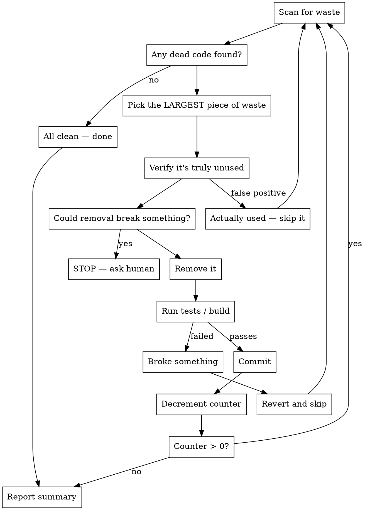

# /cleanloop — Iterative Cleanup Loop

Autonomously remove dead code, unused dependencies, stale files, and tech debt one cleanup at a time. Each cycle: scan → detect waste → verify it's truly unused → remove it → confirm nothing broke → commit. Repeat.

## Usage

```
/cleanloop [count] [target]
```

- `count` — max iterations. Omit or `0` for infinite (runs until clean or asks human).
- `target` — directory to clean. Defaults to cwd.

Examples:
```
/cleanloop 10 ~/Desktop/codemap          # 10 cleanup cycles on codemap
/cleanloop ~/Desktop/charlie-code/src    # clean until spotless
/cleanloop 5                              # 5 cycles on current directory
```

## The Loop



## Rules

**ONE cleanup per iteration.** Each cycle removes exactly one piece of waste and produces one commit. Small, verifiable, reversible.

**Pick the LARGEST waste first.** Not the easiest. Entire unused files > unused functions > unused imports > stale comments. Prioritize by lines of dead code removed.

**VERIFY before removing.** Dead code detection has false positives. Before removing anything:
- Grep for all references (including strings, configs, dynamic imports)
- Check if it's used via reflection, metaprogramming, or CLI entry points
- Check if tests reference it (test-only code is still live code)
- If there's ANY doubt, skip it and move to the next candidate

**CONTAINMENT — only touch the target project:**
- ONLY modify files inside the target directory. Nothing outside it. Ever.
- Do NOT modify ~/.claude/, settings, plugins, configs, or anything the user's other tools depend on.
- Do NOT remove dependencies that other projects might use — only remove from the project's own manifest.
- If a cleanup requires changes outside the target directory, skip it.

**If removal breaks the build:** Revert immediately. Skip that item. Move on.

**If nothing left to clean:** Stop early. A clean codebase is the goal, not an arbitrary iteration count.

## What Counts as Waste

Scan for these in priority order:

1. **Dead files** — files with zero imports/references from the rest of the project
2. **Dead functions/classes** — exported but never imported, or defined but never called
3. **Dead dependencies** — packages in the manifest that nothing imports
4. **Unused imports** — imported but never referenced in the file
5. **Dead config** — config keys that no code reads
6. **Commented-out code** — not comments, but actual code that's been commented out (>3 lines)
7. **Duplicate code** — near-identical blocks that could be one (only if trivially consolidatable)

Do NOT clean:
- Comments that explain non-obvious logic (those are documentation, not waste)
- Test fixtures or test utilities (they're used by tests)
- Types/interfaces that enforce contracts even if not directly imported
- Feature flags or environment-conditional code (may be used in other environments)

## Each Iteration

### Step 1: Scan
Use available tools to detect waste. If `codemap` is available:
```bash
codemap --dir <target> dead-functions          # unused function exports
codemap --dir <target> orphan-files            # files with no connections
codemap --dir <target> unreachable             # code that can't be reached
```
Otherwise, use Grep/Glob to find unused exports, unreferenced files, etc.

### Step 2: Pick ONE
Choose the single largest piece of waste by lines removed. State what you're removing and why.

### Step 3: Verify It's Dead
Before touching anything, confirm the code is truly unused:
```bash
# Search for ALL references — strings, dynamic imports, configs
grep -r "function_name" <target>
grep -r "file_name" <target>
```
If any reference exists that isn't the definition itself, skip it.

### Step 4: Check Safety
Ask: "Could removing this break something outside the project, or something not caught by tests?" If yes → STOP and ask.

### Step 5: Remove
Delete the dead code. If removing a function from a file, don't restructure the rest of the file — just remove the dead part.

### Step 6: Codemap Safety Check
If `codemap` is available:
```bash
codemap --dir <target> blast-radius <changed-files>
```
If blast radius is unexpectedly large — revert and reconsider.

### Step 7: Verify
Run the project's test suite or build. Everything must still pass with the dead code removed.

### Step 8: Commit
```
git add -A && git commit -m "clean: remove <what was removed> — <why it was dead>"
```

### Step 9: Report
Print one line: `[N/total] clean: removed <what> (<lines> lines) — verified unused`

Then loop.

## End Report

After all iterations (or when clean), print:

```
=== Clean Loop Complete ===
Iterations: N
Total lines removed: X
Cleanups applied:
  1. <what was removed> (<lines> lines)
  2. <what was removed> (<lines> lines)
  ...
Skipped (false positives):
  - <item that looked dead but wasn't>
Stopped because: <all clean / count reached / asked human>
```
