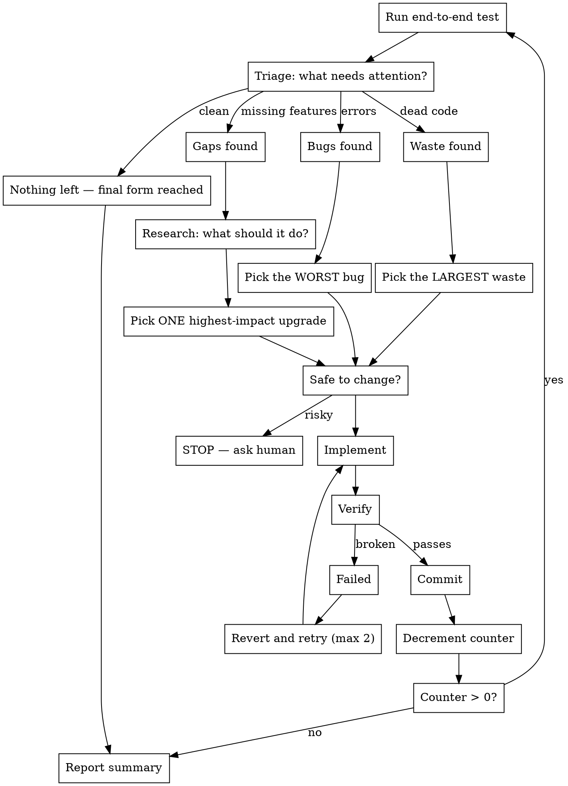

# /evolve — Iterative Project Evolution

Autonomously evolve a project toward its final form. Each cycle: test → triage → act → verify → commit. Automatically picks the right action — fix, clean, or upgrade — based on what the project needs most right now.

## Usage

```
/evolve [count] [target]
```

- `count` — number of iterations. Omit or `0` for infinite (runs until nothing left or asks human).
- `target` — directory to evolve. Defaults to cwd.

Examples:
```
/evolve 10 ~/Desktop/codemap          # 10 evolution cycles on codemap
/evolve ~/Desktop/charlie-code/src    # evolve until final form
/evolve 5                              # 5 cycles on current directory
```

## The Loop



## Priority Order

Every cycle, triage the project and act on the **highest priority category** that has work to do:

| Priority | Category | What to look for | Commit prefix |
|----------|----------|-------------------|---------------|
| 1 | **Fix** | Crashes, compile errors, wrong output, failing tests | `fix:` |
| 2 | **Clean** | Dead files, unused functions, dead dependencies, commented-out code | `clean:` |
| 3 | **Upgrade** | Missing capabilities, better patterns, new features | `upgrade:` |

Fix first. A project with bugs shouldn't get new features. Clean second. A project with dead code shouldn't grow more code. Upgrade last. Only add when the foundation is solid.

## Rules

**ONE action per iteration.** Each cycle produces exactly one commit with one change. Small, verifiable, reversible.

**Pick by priority, then by impact.** Within each category, pick the single highest-impact item — the worst bug, the largest dead code block, the most useful missing feature.

**CONTAINMENT — only touch the target project:**
- ONLY modify files inside the target directory. Nothing outside it. Ever.
- Do NOT modify ~/.claude/, settings, plugins, configs, build systems, or anything the user's other tools depend on.
- Do NOT install system-level dependencies (brew, apt, pip install --global, cargo install). You can add crate/npm dependencies to the project's own manifest.
- Do NOT modify or delete files in other projects, even if they use this one.
- If a change requires modifications outside the target directory, skip it and pick the next one.
- New files are fine — inside the target directory only.
- The target project's CLI interface and output format are yours to extend (add new actions, flags) but NEVER break existing ones.

**If a change fails twice:** Skip it. Move to the next candidate in the same or next priority category.

**If nothing left in any category:** Stop early and report. The project has reached its final form. Don't invent busywork.

## Fix Mode

When bugs are the top priority:

**Diagnose before fixing.** Read the error. Trace the code. Understand WHY it's broken, not just WHERE.

**Severity ranking:** Crashes > wrong output > missing output > warnings > cosmetic.

**Minimal fix.** Don't refactor. Don't improve surrounding code. Just fix the one issue.

## Clean Mode

When waste is the top priority:

**Verify before removing.** Dead code detection has false positives. Before removing anything:
- Grep for all references (including strings, configs, dynamic imports)
- Check reflection, metaprogramming, CLI entry points
- If there's ANY doubt, skip it

**What counts as waste (in priority order):**
1. Dead files — zero imports/references from the rest of the project
2. Dead functions/classes — defined but never called
3. Dead dependencies — in the manifest but never imported
4. Unused imports — imported but never referenced
5. Commented-out code blocks (>3 lines of actual code)

**What is NOT waste:** Explanatory comments, test fixtures, type contracts, feature flags.

## Upgrade Mode

When the project is clean and working, add capabilities:

**Research first.** Use `WebSearch` to find what similar tools/projects do that this one doesn't. Look for best practices, common features, new patterns. Informed upgrades beat blind ones.

**Pick the HIGHEST IMPACT upgrade.** Not the easiest. Ask: "What single capability would make this most useful that it can't do today?"

## Each Iteration

### Step 1: Test
Run the project's test suite, or exercise it end-to-end. Capture output, errors, warnings.

### Step 2: Deep Scan with Codemap
If `codemap` is available (check with `which codemap`), run a structural analysis to surface issues the test suite won't catch:
```bash
codemap --dir <target> dead-functions        # unused exports → Clean candidates
codemap --dir <target> orphan-files          # disconnected files → Clean candidates
codemap --dir <target> complexity .          # hotspots → Fix or Upgrade candidates
codemap --dir <target> hotspots             # most-connected code → risk areas
codemap --dir <target> unreachable          # dead code paths → Clean candidates
```
If codemap isn't available, use Grep/Glob to scan for unused exports, unreferenced files, and TODO/FIXME/HACK markers.

### Step 3: Triage
Combine test results + codemap findings. Categorize:
- **Bugs:** Errors, failures, incorrect output → Fix mode
- **Waste:** Dead code, unused deps, orphan files, unreachable paths → Clean mode
- **Gaps:** Missing features, better approaches → Upgrade mode

Act on the highest priority category that has items.

### Step 4: Research (Upgrade mode, and optionally Fix/Clean)
Use `WebSearch` to research before acting:
- **Upgrade mode:** Search for what similar tools/projects do. Find best practices, common features, established patterns. Search for `"<project-type> best practices"`, `"<framework> plugins"`, `"<tool> features comparison"`.
- **Fix mode (optional):** Search for the error message or known issues in dependencies.
- **Clean mode (optional):** Search for whether a seemingly-dead pattern is actually needed by convention.

Use `WebFetch` to pull documentation pages, changelogs, or examples that inform the implementation.

### Step 5: Pick ONE
Choose the single highest-impact item from the active category. State what you're doing and why in one sentence.

### Step 6: Check Safety
Ask: "Could this break something the user depends on?" If yes → STOP and ask. If no → proceed.

### Step 7: Implement
Build the fix, removal, or upgrade. Keep it focused — one change, minimal blast radius.

### Step 8: Post-Change Codemap Validation
If `codemap` is available, verify the change didn't make things worse:
```bash
codemap --dir <target> blast-radius <changed-files>   # what did this touch?
codemap --dir <target> complexity <changed-files>      # did complexity spike?
codemap --dir <target> dead-functions                  # did we create new waste?
```
If blast radius is unexpectedly large (>20% of codebase), complexity spiked, or new dead code appeared — revert and reconsider.

### Step 9: Verify
Run the same test from Step 1. The change should be visible. No regressions.

### Step 10: Log
Append the change to `EVOLUTION.log` in the target directory (create if it doesn't exist). Format:
```
[YYYY-MM-DD HH:MM] <prefix>: <one-line description>
  codemap: complexity=<before>→<after>, dead_functions=<count>
  source: <what informed this — test output / codemap finding / web research>
```

### Step 11: Commit
```
git add -A && git commit -m "<prefix>: <what was done>"
```
Use the prefix from the priority table: `fix:`, `clean:`, or `upgrade:`. The commit includes the EVOLUTION.log entry from Step 10.

### Step 12: Report
Print one line: `[N/total] <prefix>: <what> — verified on <target>`

Then loop.

## End Report

After all iterations (or when done), print:

```
=== Evolution Complete ===
Iterations: N
Changes applied:
  [fix]     1. <description>
  [clean]   2. <description>
  [upgrade] 3. <description>
  ...
Skipped (failed or risky):
  - <description>
Stopped because: <final form reached / count reached / asked human>
Evolution log: <target>/EVOLUTION.log
```
