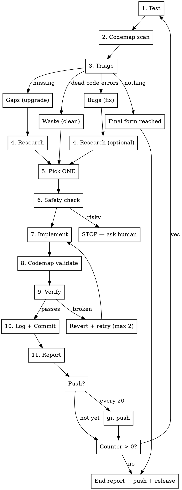

# /evolve — Iterative Project Evolution

Autonomously evolve a project toward its final form. Each cycle: test → triage → act → verify → commit. Automatically picks the right action — fix, clean, or upgrade — based on what the project needs most right now.

## Usage

```
/evolve [count] [target] [--dry-run] [--goals]
```

- `count` — number of iterations. Omit or `0` for infinite (runs until nothing left or asks human).
- `target` — directory to evolve. Defaults to cwd.
- `--dry-run` — scan and triage only. Reports what it would do without making any changes.
- `--goals` — goal-directed mode. Scans the project, presents a menu of possible evolution paths, lets you pick which ones to pursue, then grinds autonomously toward those targets.

Examples:
```
/evolve 10 ~/Desktop/codemap          # 10 evolution cycles on codemap
/evolve ~/Desktop/charlie-code/src    # evolve until final form
/evolve 5                              # 5 cycles on current directory
/evolve --dry-run ~/Desktop/my-app    # show what needs fixing without touching anything
/evolve --goals ~/Desktop/my-project  # pick goals, then grind toward them
```

## The Loop



## Priority Order

Every cycle, triage the project and act on the **highest priority category** that has work to do:

| Priority | Category | What to look for | Commit prefix |
|----------|----------|-------------------|---------------|
| 1 | **Fix** | Crashes, compile errors, wrong output, failing tests | `fix:` |
| 2 | **Clean** | Dead files, unused functions, dead dependencies, commented-out code | `clean:` |
| 3 | **Upgrade** | Missing capabilities, better patterns, new features | `upgrade:` |

Fix first. A project with bugs shouldn't get new features. Clean second. A project with dead code shouldn't grow more code. Upgrade last. Only add when the foundation is solid.

## Rules

**ONE action per iteration.** Each cycle produces exactly one commit with one change. Small, verifiable, reversible.

**Pick by priority, then by impact.** Within each category, pick the single highest-impact item — the worst bug, the largest dead code block, the most useful missing feature.

**CONTAINMENT — only touch the target project:**
- ONLY modify files inside the target directory. Nothing outside it. Ever.
- Do NOT modify ~/.claude/, settings, plugins, configs, build systems, or anything the user's other tools depend on.
- Do NOT install system-level dependencies (brew, apt, pip install --global, cargo install). You can add crate/npm dependencies to the project's own manifest.
- Do NOT modify or delete files in other projects, even if they use this one.
- If a change requires modifications outside the target directory, skip it and pick the next one.
- New files are fine — inside the target directory only.
- The target project's CLI interface and output format are yours to extend (add new actions, flags) but NEVER break existing ones.

**If a change fails verification:** Revert with `git checkout -- .` to restore the working tree, then retry with a different approach (max 2 attempts). If it fails twice, skip it and move to the next candidate.

**If nothing left in any category:** Stop early and report. The project has reached its final form. Don't invent busywork.

## Fix Mode

When bugs are the top priority:

**Diagnose before fixing.** Read the error. Trace the code. Understand WHY it's broken, not just WHERE.

**Severity ranking:** Crashes > wrong output > missing output > warnings > cosmetic.

**Minimal fix.** Don't refactor. Don't improve surrounding code. Just fix the one issue.

## Clean Mode

When waste is the top priority:

**Verify before removing.** Dead code detection has false positives. Before removing anything:
- Grep for all references (including strings, configs, dynamic imports)
- Check reflection, metaprogramming, CLI entry points
- If there's ANY doubt, skip it

**What counts as waste (in priority order):**
1. Dead files — zero imports/references from the rest of the project
2. Dead functions/classes — defined but never called
3. Dead dependencies — in the manifest but never imported
4. Unused imports — imported but never referenced
5. Commented-out code blocks (>3 lines of actual code)

**What is NOT waste:** Explanatory comments, test fixtures, type contracts, feature flags.

## Upgrade Mode

When the project is clean and working, add capabilities:

**Research first.** Use `WebSearch` to find what similar tools/projects do that this one doesn't. Look for best practices, common features, new patterns. Informed upgrades beat blind ones.

**Pick the HIGHEST IMPACT upgrade.** Not the easiest. Ask: "What single capability would make this most useful that it can't do today?"

## Goal-Directed Mode (`--goals`)

When `--goals` is passed, evolve runs an interactive planning phase before the loop:

### Phase 1: Discovery
Run Steps 1-4 (Test, Codemap, Triage, Research) but collect ALL findings across all categories instead of picking one. Present them as a numbered menu:

```
=== Evolution Goals ===
Project: ~/Desktop/my-project

Fixes available:
  1. [fix] Auth middleware crashes on expired JWT tokens
  2. [fix] Race condition in WebSocket reconnect

Cleanup available:
  3. [clean] 12 dead functions in utils/ (codemap)
  4. [clean] 3 unused dependencies in package.json

Upgrades possible:
  5. [upgrade] Add rate limiting to API endpoints
  6. [upgrade] Migrate from CommonJS to ESM
  7. [upgrade] Add OpenTelemetry tracing
  8. [upgrade] Connection pooling for database

Pick goals (comma-separated, or 'all'): _
```

### Phase 2: Grind
After the user picks goals, evolve works through them in priority order (fixes first, then clean, then upgrades). Each goal may take multiple iterations. The loop continues until all selected goals are complete or the iteration count is reached.

During grind, the triage step only considers items that serve the selected goals — it ignores other findings. If a goal turns out to be infeasible (fails twice), skip it and move to the next selected goal.

Report progress against goals:
```
[3/∞] upgrade: add rate limiting to /api/users — 1 of 3 goals complete
```

## Each Iteration

### Step 1: Test
Run the project's test suite, or exercise it end-to-end. Capture output, errors, warnings.

**No test suite?** Adapt to what the project has:
- **Has a build/compile step:** run it — build errors are bugs
- **Has a CLI:** run it with `--help` or a basic command — crashes are bugs
- **Is a library:** check that it parses/imports without errors
- **Is config/docs only:** skip to Step 2 — codemap and manual review are the test

### Step 2: Deep Scan with Codemap
If `codemap` is available (check with `which codemap`), run a structural analysis to surface issues the test suite won't catch:
```bash
codemap --dir <target> dead-functions        # unused exports → Clean candidates
codemap --dir <target> orphan-files          # disconnected files → Clean candidates
codemap --dir <target> complexity .          # hotspots → Fix or Upgrade candidates
codemap --dir <target> hotspots             # most-connected code → risk areas
codemap --dir <target> unreachable          # dead code paths → Clean candidates
```
If codemap isn't available, use Grep/Glob to scan for unused exports, unreferenced files, and TODO/FIXME/HACK markers.

**Large codebases (>500 files):** Use the `Agent` tool to dispatch parallel subagents for scanning. Each agent searches a different area (e.g., one for dead code, one for complexity, one for TODO/FIXME markers). Merge their findings in Step 3. This is much faster than sequential scanning on large projects.

### Step 3: Triage
Combine test results + codemap findings. Categorize:
- **Bugs:** Errors, failures, incorrect output → Fix mode
- **Waste:** Dead code, unused deps, orphan files, unreachable paths → Clean mode
- **Gaps:** Missing features, better approaches → Upgrade mode

Act on the highest priority category that has items.

### Step 4: Research (Upgrade mode, and optionally Fix/Clean)
Use `WebSearch` to research before acting:
- **Upgrade mode:** Search for what similar tools/projects do. Find best practices, common features, established patterns. Search for `"<project-type> best practices"`, `"<framework> plugins"`, `"<tool> features comparison"`.
- **Fix mode (optional):** Search for the error message or known issues in dependencies.
- **Clean mode (optional):** Search for whether a seemingly-dead pattern is actually needed by convention.

Use `WebFetch` to pull documentation pages, changelogs, or examples that inform the implementation.

**Wiki search (AI/ML projects only):** If the target project involves inference, training, retrieval, agents, or ML infrastructure, also search the local wiki via `hybrid_search` MCP tool for relevant techniques, architectures, and prior decisions. The wiki has recent papers, proven patterns, and architectural decisions that post-date training data. Do NOT use wiki for general-purpose code projects — it covers AI/ML topics only.

**Framework docs (context7):** If the target uses a known framework or library (React, Next.js, Express, Django, Tailwind, Prisma, etc.), use the context7 MCP tools (`resolve-library-id` then `query-docs`) to fetch current documentation before upgrading. This prevents suggesting deprecated APIs or outdated patterns. Especially useful for version migrations and API changes.

### Step 5: Pick ONE
Choose the single highest-impact item from the active category. State what you're doing and why in one sentence.

### Step 6: Check Safety
**If `--dry-run`:** Print the triage results and picked item, then stop. Do not implement, commit, or modify anything. Format:
```
[dry-run] Would <prefix>: <description>
  category: <fix|clean|upgrade>
  source: <what surfaced this>
```
Then skip to the next iteration (or end if count reached).

**Otherwise:** Ask: "Could this break something the user depends on?" If yes → STOP and ask. If no → proceed.

### Step 7: Implement
Build the fix, removal, or upgrade. Keep it focused — one change, minimal blast radius.

### Step 8: Post-Change Codemap Validation
If `codemap` is available, verify the change didn't make things worse:
```bash
codemap --dir <target> blast-radius <changed-files>   # what did this touch?
codemap --dir <target> complexity <changed-files>      # did complexity spike?
codemap --dir <target> dead-functions                  # did we create new waste?
```
If blast radius is unexpectedly large (>20% of codebase), complexity spiked, or new dead code appeared — revert and reconsider.

### Step 9: Verify
Run the same test from Step 1. The change should be visible. No regressions.

### Step 10: Log + Commit
Append to `EVOLUTION.log` and commit in a single Bash command — no separate Edit call needed:
```bash
printf '[%s] %s: %s\n  source: %s\n\n' \
  "$(date '+%Y-%m-%d %H:%M')" "<prefix>" "<description>" "<source>" \
  >> EVOLUTION.log && git add -A && git commit -m "<prefix>: <description>"
```
Use the prefix from the priority table: `fix:`, `clean:`, or `upgrade:`. The `source` field records what informed the change (test output, codemap finding, web research, wiki, etc.).

### Step 11: Report
Print one line: `[N/total] <prefix>: <what> — verified on <target>`

Then loop.

## Publishing

Evolve commits locally on every iteration but batches pushes to avoid spamming the remote.

**Push every 20 iterations** — after Step 11, if `iteration_count % 20 == 0`, push to the remote:
```bash
git push origin HEAD 2>/dev/null || true   # silent no-op if no remote
```

**Always push on completion** — when the evolve run ends (count reached, final form, or stopped), push all remaining commits.

**GitHub release on completion** — if `gh` is available and the project has a remote, create a release summarizing all changes:
```bash
gh release create "v<version>-evolve-<date>" \
  --title "Evolution: <N> changes applied" \
  --notes-file <(cat <<NOTES
## Changes Applied

$(cat EVOLUTION.log | tail -<lines_from_this_run>)

---
*Autonomously evolved by /evolve*
NOTES
)
```
Skip the release if the target has no GitHub remote or fewer than 3 changes were made.

## End Report

After all iterations (or when done), print:

```
=== Evolution Complete ===
Iterations: N
Changes applied:
  [fix]     1. <description>
  [clean]   2. <description>
  [upgrade] 3. <description>
  ...
Skipped (failed or risky):
  - <description>
Stopped because: <final form reached / count reached / asked human>
Evolution log: <target>/EVOLUTION.log
```

Then push remaining commits and create the GitHub release.
