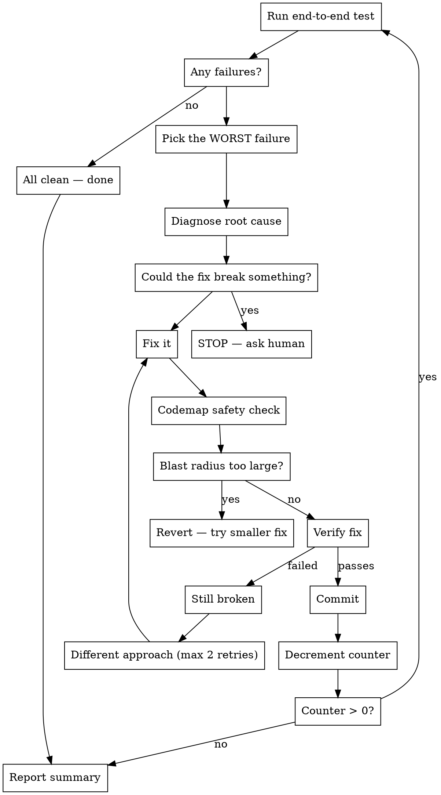

# /fixloop — Iterative Fix Loop

Autonomously find and fix issues one at a time. Each cycle: test → find what's broken → diagnose → fix → verify → commit. Repeat until clean.

## Usage

```
/fixloop [count] [target]
```

- `count` — max iterations. Omit or `0` for infinite (runs until clean or asks human).
- `target` — directory to fix. Defaults to cwd.

Examples:
```
/fixloop 10 ~/Desktop/codemap              # up to 10 fix cycles
/fixloop ~/Desktop/charlie-code/src         # fix until clean
/fixloop 5                                  # 5 cycles on current directory
```

## The Loop



## Rules

**ONE fix per iteration.** Fix the single worst issue. Do not batch fixes. Each cycle = one commit = one fix.

**Pick the WORST issue.** Not the easiest. Crashes > wrong output > missing output > cosmetic. Prioritize: errors → correctness → performance → style.

**CONTAINMENT — only touch the target project:**
- ONLY modify files inside the target directory. Nothing outside it. Ever.
- Do NOT modify ~/.claude/, settings, plugins, configs, or anything the user's other tools depend on.
- Do NOT install system-level dependencies.
- If the root cause is in a dependency (not your code), skip the fix and report it as "external dependency issue" in the end report.
- If a fix would require changes outside the target directory, skip it.
- Existing CLI interface and output format must not change. Fix bugs in them, don't redesign them.

**If a fix fails twice:** Skip it. Move to the next issue. Report it as unresolved at the end.

**Diagnose before fixing.** Read the error. Trace the code. Understand WHY it's broken, not just WHERE. A fix without diagnosis is a guess.

**If all tests pass:** Stop early. Don't look for problems that aren't there.

## Each Iteration

### Step 1: Test
Run the project's test suite, or exercise it end-to-end on a real target. Capture errors, failures, warnings, unexpected output.

### Step 2: Triage
List all failures. Rank by severity:
1. Crashes / panics / compile errors
2. Wrong output / incorrect behavior
3. Missing functionality
4. Warnings / deprecations
5. Performance issues

Pick #1.

### Step 3: Diagnose
Read the error. Trace the code path. Identify the root cause — not the symptom. State in one sentence: "This breaks because X."

### Step 4: Check Safety
Before fixing, ask: "Could this fix break something else?" If yes → STOP and ask. If no → proceed.

### Step 5: Fix
Implement the minimal fix. Don't refactor. Don't improve. Don't clean up surrounding code. Just fix the one issue.

### Step 6: Codemap Safety Check
If `codemap` is available:
```bash
codemap --dir <target> blast-radius <changed-files>
codemap --dir <target> complexity <changed-files>
```
If blast radius is unexpectedly large or complexity spiked — revert and try a more targeted fix. If codemap isn't available, skip this step.

### Step 7: Verify
Run the same test from Step 1. The specific failure must be gone. No new failures introduced.

### Step 8: Commit
```
git add -A && git commit -m "fix: <what was broken and why>"
```

### Step 9: Report
Print one line: `[N/total] fix: <what was broken> — root cause: <why>`

Then loop.

## End Report

After all iterations (or when clean), print:

```
=== Fix Loop Complete ===
Iterations: N
Fixes applied:
  1. <what was broken> — root cause: <why>
  2. <what was broken> — root cause: <why>
  ...
Unresolved (failed after 2 attempts):
  - <issue description>
Stopped because: <all clean / count reached / asked human>
```
