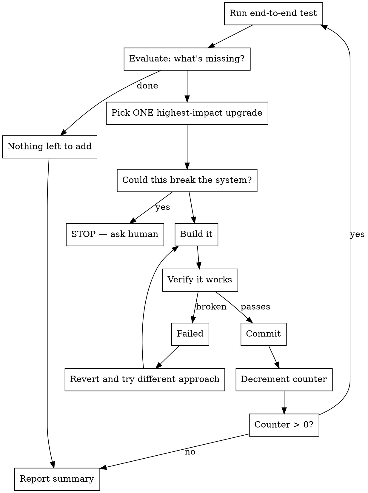

# /upgradeloop — Iterative Upgrade Loop

Autonomously improve a project one upgrade at a time. Each cycle: test → evaluate → pick the best upgrade → build it → verify → commit. Repeat.

## Usage

```
/upgradeloop [count] [target]
```

- `count` — number of iterations. Omit or `0` for infinite (runs until stopped or asks human).
- `target` — directory to upgrade. Defaults to cwd.

Examples:
```
/upgradeloop 5 ~/Desktop/codemap          # 5 upgrade cycles on codemap
/upgradeloop ~/Desktop/charlie-code/src    # infinite until stopped
/upgradeloop 10                            # 10 cycles on current directory
```

## The Loop



## Rules

**ONE upgrade per iteration.** Do not batch. Each cycle produces exactly one commit with one improvement. Small, verifiable, reversible.

**Pick the HIGHEST IMPACT upgrade.** Not the easiest. Not random. After testing, ask: "What single capability would make this most useful that it can't do today?" Build that one.

**CONTAINMENT — only touch the target project:**
- ONLY modify files inside the target directory. Nothing outside it. Ever.
- Do NOT modify ~/.claude/, settings, plugins, configs, build systems, or anything the user's other tools depend on.
- Do NOT install system-level dependencies (brew, apt, pip install --global, cargo install). You can add crate/npm dependencies to the project's own manifest.
- Do NOT modify or delete files in other projects, even if they use this one.
- If an upgrade requires changes outside the target directory, skip it and pick the next one.
- New files are fine — inside the target directory only.
- The target project's CLI interface and output format are yours to extend (add new actions, flags) but NEVER break existing ones. Existing actions must produce the same output.

**If a build fails:** Revert. Try a different approach. Do not burn iterations on repeated failures — if the same upgrade fails twice, skip it and pick the next highest-impact one.

**If nothing left to upgrade:** Stop early and report. Don't invent busywork.

## Each Iteration

### Step 1: Test
Run the project's test suite, or exercise it end-to-end on a real target. Capture the output. This is your baseline for this iteration.

### Step 2: Evaluate
Look at the output. What can't it do that it should? What information is missing? What would make the output more useful? Rank the gaps by impact.

### Step 3: Pick ONE
Choose the single highest-impact missing capability. State what you're building and why in one sentence.

### Step 4: Check Safety
Before building, ask: "Could this break something the user depends on?" If yes → STOP and ask. If no → proceed.

### Step 5: Build
Implement the upgrade. Keep it focused — one capability, minimal blast radius.

### Step 6: Codemap Safety Check
If `codemap` is available, run it on the project before and after:
```bash
codemap --dir <target> blast-radius <changed-files>   # what did this touch?
codemap --dir <target> complexity <changed-files>      # did complexity spike?
codemap --dir <target> dead-functions                  # did we break exports?
```
If blast radius is unexpectedly large (>20% of codebase) or complexity spiked significantly — revert and reconsider. If codemap isn't available, skip this step.

### Step 7: Verify
Run the same test from Step 1. The upgrade should be visible in the output. Existing functionality must not regress.

### Step 8: Commit
```
git add -A && git commit -m "upgrade: <what was added>"
```

### Step 9: Report
Print one line: `[N/total] upgrade: <what> — verified on <target>`

Then loop.

## End Report

After all iterations (or when stopped), print a summary:

```
=== Upgrade Loop Complete ===
Iterations: N
Upgrades applied:
  1. <what was added>
  2. <what was added>
  ...
Stopped because: <count reached / nothing left / asked human>
```
